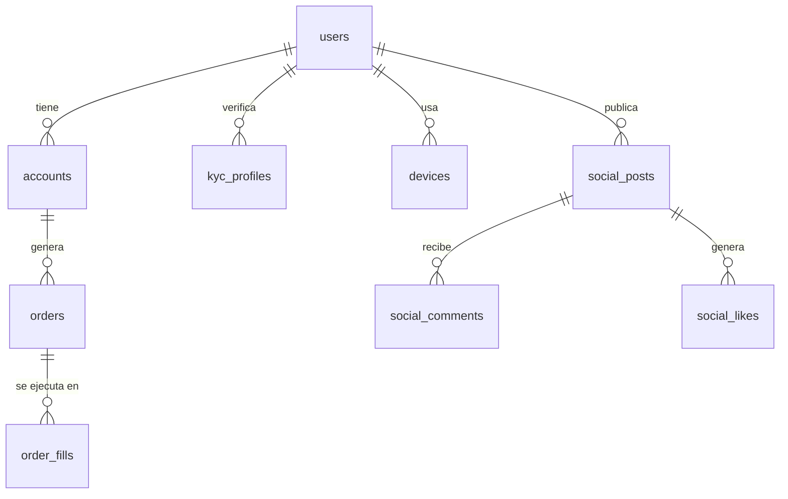
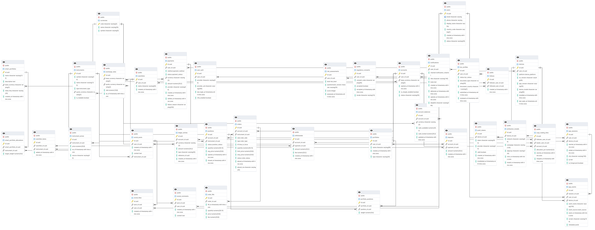

<div align="center">

### UNIVERSIDAD DE INGENIERÍA Y TECNOLOGÍA  
**Maestría en Ciencia de Datos e Inteligencia Artificial**

---

# Base de Datos – Análisis de Negocio y Modelado Relacional  
**Empresa Analizada: _eToro_**

---

</div>

**Integrantes**  
- Diego Sánchez Salazar  
- Estuardo Oliver Campos  
- Nicole Arenas Lazo  
- Gianmarco Alessandro Mejía Meléndez  
- Piero Palacios Bernuy  
- Edgard Inga Froylan  
- Winton Flores Quispe

**Docente:** Luis Chicoma  
**Fecha:** 14 de octubre de 2025  

---

## Índice

- [Resumen ejecutivo](#-resumen-ejecutivo)
- [1. Análisis de la empresa eToro](#1-análisis-de-la-empresa-etoro)
  - [1.1 Giro de negocio](#11-giro-de-negocio)
  - [1.2 Clientes](#12-clientes)
  - [1.3 Productos y servicios](#13-productos-y-servicios)
  - [1.4 Canales](#14-canales)
  - [1.5 Business Model Canvas](#15-business-model-canvas)
- [2. Modelo Entidad–Relación (ER)](#2-modelo-entidadrelación-er)
- [3. Implementación en SQL](#3-implementación-en-sql)
  - [3.1 Definiciones (DDL)](#31-definiciones-ddl)
  - [3.2 Carga inicial (DML)](#32-carga-inicial-dml)
- [4. Consultas de negocio orientadas a IA](#4-consultas-de-negocio-orientadas-a-ia)
- [5. Propuesta de features para IA](#5-propuesta-de-features-para-ia)
- [6. Conclusiones](#6-conclusiones)
- [Anexos](#anexos)
  - [Anexo A. Esquema DDL (CREATE TABLE)](#anexo-a-esquema-ddl-create-table)
  - [Anexo B. Carga DML (INSERT INTO)](#anexo-b-carga-dml-insert-into)
  - [Anexo C. Visión de esquema y diccionario de datos](#anexo-c-visión-de-esquema-y-diccionario-de-datos)

---

# 📘 RESUMEN EJECUTIVO

Este informe académico analiza el modelo de negocio y la estructura de base de datos de **eToro**, una fintech global enfocada en el *trading social* y la inversión en línea. El documento abarca análisis, diseño e implementación del modelo relacional del canal principal, e integra consultas orientadas a la **generación de features** para modelos de IA.

[↑ Volver al índice](#índice)

---

# 1. ANÁLISIS DE LA EMPRESA ETORO

## 1.1 Giro de Negocio
eToro es una **plataforma de corretaje y fintech** de inversión multi-activo con un componente de red social, que permite **copiar estrategias** de inversores.

## 1.2 Clientes
Foco en **inversionistas minoristas** que operan online (web/móvil) y aprenden de la comunidad. Presencia en **>100 países**.

## 1.3 Productos y Servicios
- Activos: acciones, criptomonedas, ETFs, divisas, índices, materias primas.  
- Social trading: *CopyTrader*, *Smart Portfolios*.  
- Servicios: depósitos/retiros, FX y educacionales.

## 1.4 Canales Principales
- Plataforma web y aplicación móvil (canal principal).  
- Marketing digital, redes sociales, centro de ayuda.

## 1.5 Business Model Canvas
| Elemento | Descripción |
|---|---|
| Segmentos de Clientes | Inversores minoristas con interés en trading social. |
| Propuesta de Valor | Inversión multi-activo + red social de trading. |
| Canales | App, web, marketing digital, comunidad. |
| Relaciones con Clientes | Comunidad social, soporte, recompensas. |
| Fuentes de Ingresos | Spreads, comisiones, tarifas, conversiones. |
| Recursos Clave | Tecnología, licencias, comunidad, alianzas. |
| Actividades Clave | Desarrollo, marketing, soporte, cumplimiento. |
| Socios Clave | Bancos, redes de pago, proveedores de liquidez. |
| Estructura de Costos | Tecnología, marketing, soporte, cumplimiento. |

[↑ Volver al índice](#índice)

---

# 2. MODELO ENTIDAD–RELACIÓN (ER)

El modelo refleja la estructura lógica del canal digital principal. Incluye entidades de usuarios, cuentas, operaciones y actividades sociales.



*(Extracto visual resumido del modelo completo).*  

### MER


[↑ Volver al índice](#índice)

---

# 3. IMPLEMENTACIÓN EN SQL

Implementación en **PostgreSQL 13+**, con **UUID**, **ENUMs**, claves foráneas e índices.

## 3.1 Definiciones (DDL)

> Ver **[Anexo A](#anexo-a-esquema-ddl-create-table)**.

## 3.2 Carga inicial (DML)

> Ver **[Anexo B](#anexo-b-carga-dml-insert-into)**.

[↑ Volver al índice](#índice)

---

# 4. CONSULTAS DE NEGOCIO ORIENTADAS A IA

* **Conversión temprana (7 días)**
  Mide la activación inicial: porcentaje de usuarios cuyo **primer trade** ocurre dentro de los 7 días posteriores al registro; insumo directo para optimizar onboarding y nudges.

* **Intervalo promedio entre compras por grupo (mes de registro)**
  Compara la **frecuencia de compra** entre grupos de usuarios creados por **mes de registro**, calculando el **promedio de días entre compras** por grupo para ajustar cadencia de re-engagement.

* **AOV por categoría**
  Calcula el **ticket promedio** por categoría de producto/cartera (normalizado a moneda base) para priorizar categorías rentables y orientar campañas y cross-sell.

* **Devoluciones–reclamos**
  Estima la **fricción operacional** como razón de (devoluciones + *chargebacks*) sobre transacciones, para detectar problemas por **método de pago/PSP/país** y gatillar acciones antifraude/soporte.

* **Churn (90 días)**
  Identifica **inactividad** marcando usuarios sin actividad relevante por >90 días, habilitando **win-back** segmentado según riesgo/valor (LTV) y canal de adquisición.


[↑ Volver al índice](#índice)

---

# 5. PROPUESTA DE FEATURES PARA IA

| Nombre                                      | Descripción                                                                                                       | Script SQL                                                                                   | Uso en IA                                      |
|---------------------------------------------|-------------------------------------------------------------------------------------------------------------------|-----------------------------------------------------------------------------------------------|------------------------------------------------|
| Engagement de 30 días: sesiones, días activos, eventos y apertura de notificaciones                | Construye señales de comportamiento recientes para modelos de **retención y churn**. Calcula, por usuario, la actividad en los últimos **30 días**: número de **sesiones**, **días activos**, **eventos** de app, **pushes enviados/abiertos** y la **tasa de apertura**. El resultado sirve como *feature store* continuo y puede segmentarse en **bajo/medio/alto** engagement para operación. | [30_day_engagement_feature.sql](./queries_of_the_bussiness/30_day_engagement_feature.sql)          | Onboarding, propensity to start                |
| Comportamiento y desempeño de trading a 90 días | Caracteriza el **estilo** y la **habilidad** del usuario en los últimos 90 días para recomendaciones de **copy-trading** y segmentación: volumen y conteo de trades, **win rate**, **P&L realizado en USD**, **tamaño promedio** y **diversificación** por instrumentos y monedas. | [90_days_trading_behaviour.sql](./queries_of_the_bussiness/90_days_trading_behaviour.sql)                 | Retención, segmentación RFM                    |
| Riesgo de concentración en posiciones abiertas (HHI)                 | Mide qué tan **concentrado** está el portafolio abierto de cada usuario usando el **Índice de Herfindahl–Hirschman (HHI)**: suma de los **pesos al cuadrado** de cada instrumento sobre el valor total en USD. - **Cerca de 1** → apuesta concentrada (uno o pocos instrumentos). - **Cerca de 0** → portafolio diversificado. Incluye `margin_enabled` para capturar apetito de apalancamiento. | [concentration_risk.sql](./queries_of_the_bussiness/concentration_risk.sql)               | Propensión a volver, campañas in-app           |
| Influencia social y de copy-trading                   | Construye señales para identificar **quién conviene copiar** y **quién influye** en la comunidad. Resume actividad creada y recibida (calidad de contenido/engagement) y prueba social operativa (seguidores y copiadores activos) para **rankear líderes** y alimentar recomendaciones de **CopyTrader**.                           | [social_and_copy_trading.sql](./queries_of_the_bussiness/social_and_copy_trading.sql)               | Churn modeling, triggers de win-back           |
| Top 100 usuarios leales (score combinado de engagement + retención)                  | Este análisis identifica a los 100 usuarios más leales de la plataforma, combinando su nivel de actividad reciente, intensidad de uso diario, respuesta a notificaciones y retención a 90 días, para revelar quiénes sostienen el mayor compromiso real con el ecosistema.                   | [top_100_loyal_users_query.sql](./queries_of_the_bussiness/top_100_loyal_users_query.sql)         | Eficiencia de adquisición, ROAS                |


[↑ Volver al índice](#índice)

---

# 6. CONCLUSIONES

El modelo relacional es **coherente con la operación fintech** y habilita integridad y analítica para **activación, valor y retención** en modelos predictivos.  

[↑ Volver al índice](#índice)

---

# Anexos

## Anexo A. Esquema DDL (CREATE TABLE)

> Base de datos de eToro.  

[DB eToro DDL](./creation_of_db/schema.sql)

> DDL para Features

[Features DDL](./creation_of_features/features_schemas.sql)
[Data Features DDL](./creation_of_features/fill_of_features.sql)

## Anexo B. Carga DML (INSERT INTO)

> Data de prueba.  

[Data eToro DML](./creation_of_db/seed_data.sql)

---

## Anexo C. Visión de esquema y diccionario de datos

### Schema Overview (dominios)

**Identity, Access & Compliance**
`users`, `user_auth`, `kyc_profiles`, `risk_assessments`, `regulatory_consents`

**Devices, Telemetry & Notifications**
`devices`, `push_tokens`, `app_sessions`, `app_events`, `notifications`, `attribution_installs`

**Currencies, Accounts & Ledger**
`currencies`, `exchange_rates`, `accounts`, `account_balances`, `ledger_entries`, `payments`, `deposits`, `withdrawals`

**Markets, Orders & Positions**
`instruments`, `instrument_prices`, `orders`, `order_fills`, `positions`

**Portfolios & Social**
`portfolios`, `portfolio_positions`, `smart_portfolios`, `smart_portfolio_allocations`, `copy_trading_links`, `watchlists`, `watchlist_items`, `social_posts`, `social_comments`, `social_likes`, `follows`

**Feature Store (propuesto)**
`feat.user_features_core`, `feat.user_features_onboarding`, `feat.user_features_engagement_30d`, `feat.user_features_trading_90d`, `feat.user_features_concentration_open`, `feat.user_features_social`


---

### 1) Identity, Access & Compliance

#### `users` — Perfil base

| Columna      | Tipo        | Nulo | Default           | PK | FK | Descripción                       |
| ------------ | ----------- | ---- | ----------------- | -- | -- | --------------------------------- |
| id           | uuid        |      | gen_random_uuid() | ✔️ |    | Identificador único del usuario.  |
| email        | varchar     |      |                   |    |    | Correo único para login/avisos.   |
| phone        | varchar     | ✔️   |                   |    |    | Teléfono (opcional).              |
| display_name | varchar     | ✔️   |                   |    |    | Alias público en la red social.   |
| country_code | varchar(2)  | ✔️   |                   |    |    | Código ISO del país.              |
| created_at   | timestamptz |      | now()             |    |    | Fecha de alta.                    |
| status       | varchar(20) | ✔️   |                   |    |    | Estado (active/suspended/closed). |

#### `user_auth` — Proveedores de autenticación

| Columna       | Tipo         | Nulo | Default           | PK | FK        | Descripción                       |
| ------------- | ------------ | ---- | ----------------- | -- | --------- | --------------------------------- |
| id            | uuid         |      | gen_random_uuid() | ✔️ |           | ID del vínculo de autenticación.  |
| user_id       | uuid         |      |                   |    | users(id) | Usuario asociado.                 |
| provider      | varchar(50)  | ✔️   |                   |    |           | password/google/apple…            |
| provider_uid  | varchar(200) | ✔️   |                   |    |           | Identificador en el proveedor.    |
| last_login_at | timestamptz  | ✔️   |                   |    |           | Último inicio por este proveedor. |
| mfa_enabled   | boolean      | ✔️   |                   |    |           | MFA habilitado.                   |

#### `kyc_profiles` — Verificación de identidad (KYC)

| Columna          | Tipo        | Nulo | Default           | PK | FK        | Descripción                  |
| ---------------- | ----------- | ---- | ----------------- | -- | --------- | ---------------------------- |
| id               | uuid        |      | gen_random_uuid() | ✔️ |           | ID KYC.                      |
| user_id          | uuid        |      |                   |    | users(id) | Usuario verificado.          |
| status           | kyc_status  |      | 'pending'         |    |           | Estado (pending/approved/…). |
| document_type    | varchar(30) | ✔️   |                   |    |           | Tipo de documento.           |
| document_country | varchar(2)  | ✔️   |                   |    |           | País emisor.                 |
| submitted_at     | timestamptz | ✔️   |                   |    |           | Envío KYC.                   |
| reviewed_at      | timestamptz | ✔️   |                   |    |           | Revisión KYC.                |

#### `risk_assessments` — Perfil de riesgo del inversor

| Columna               | Tipo        | Nulo | Default           | PK | FK        | Descripción              |
| --------------------- | ----------- | ---- | ----------------- | -- | --------- | ------------------------ |
| id                    | uuid        |      | gen_random_uuid() | ✔️ |           | ID evaluación.           |
| user_id               | uuid        |      |                   |    | users(id) | Usuario evaluado.        |
| level                 | risk_level  |      |                   |    |           | Nivel (low/…/very_high). |
| questionnaire_version | varchar(20) | ✔️   |                   |    |           | Versión de cuestionario. |
| score                 | int         | ✔️   |                   |    |           | Puntuación cuantitativa. |
| assessed_at           | timestamptz |      |                   |    |           | Fecha de evaluación.     |

#### `regulatory_consents` — Consentimientos regulatorios

| Columna      | Tipo        | Nulo | Default           | PK | FK        | Descripción                        |
| ------------ | ----------- | ---- | ----------------- | -- | --------- | ---------------------------------- |
| id           | uuid        |      | gen_random_uuid() | ✔️ |           | ID consentimiento.                 |
| user_id      | uuid        |      |                   |    | users(id) | Usuario que acepta.                |
| consent_code | varchar(50) | ✔️   |                   |    |           | Código (tos, privacy, marketing…). |
| accepted     | boolean     |      | true              |    |           | Indicador de aceptación.           |
| accepted_at  | timestamptz |      | now()             |    |           | Fecha de aceptación.               |
| locale       | varchar(10) | ✔️   |                   |    |           | Idioma/región.                     |

---

### 2) Devices, Telemetry & Notifications

#### `devices` — Dispositivos

| Columna      | Tipo            | Nulo | Default           | PK | FK        | Descripción           |
| ------------ | --------------- | ---- | ----------------- | -- | --------- | --------------------- |
| id           | uuid            |      | gen_random_uuid() | ✔️ |           | ID del dispositivo.   |
| user_id      | uuid            |      |                   |    | users(id) | Propietario.          |
| platform     | device_platform |      |                   |    |           | iOS/Android.          |
| os_version   | varchar(40)     | ✔️   |                   |    |           | Versión del SO.       |
| app_version  | varchar(20)     | ✔️   |                   |    |           | Versión de la app.    |
| device_model | varchar(80)     | ✔️   |                   |    |           | Modelo.               |
| installed_at | timestamptz     | ✔️   |                   |    |           | Fecha de instalación. |
| last_seen_at | timestamptz     | ✔️   |                   |    |           | Última actividad.     |

#### `push_tokens` — Tokens de notificación

| Columna        | Tipo         | Nulo | Default           | PK | FK          | Descripción           |
| -------------- | ------------ | ---- | ----------------- | -- | ----------- | --------------------- |
| id             | uuid         |      | gen_random_uuid() | ✔️ |             | ID token.             |
| device_id      | uuid         |      |                   |    | devices(id) | Dispositivo asociado. |
| token          | varchar(300) |      |                   |    |             | Token push.           |
| provider       | varchar(20)  | ✔️   |                   |    |             | apns/fcm.             |
| valid          | boolean      | ✔️   | true              |    |             | Vigente.              |
| created_at     | timestamptz  | ✔️   | now()             |    |             | Alta.                 |
| invalidated_at | timestamptz  | ✔️   |                   |    |             | Invalidez.            |

#### `app_sessions` — Sesiones de aplicación

| Columna       | Tipo         | Nulo | Default           | PK | FK          | Descripción      |
| ------------- | ------------ | ---- | ----------------- | -- | ----------- | ---------------- |
| id            | uuid         |      | gen_random_uuid() | ✔️ |             | ID sesión.       |
| user_id       | uuid         |      |                   |    | users(id)   | Usuario.         |
| device_id     | uuid         |      |                   |    | devices(id) | Dispositivo.     |
| started_at    | timestamptz  |      | now()             |    |             | Inicio.          |
| ended_at      | timestamptz  | ✔️   |                   |    |             | Fin.             |
| city          | varchar(100) | ✔️   |                   |    |             | Ciudad estimada. |
| ip            | inet         | ✔️   |                   |    |             | IP.              |
| is_foreground | boolean      | ✔️   |                   |    |             | En primer plano. |

#### `app_events` — Eventos de interacción/SDK

| Columna      | Tipo         | Nulo | Default           | PK | FK               | Descripción              |
| ------------ | ------------ | ---- | ----------------- | -- | ---------------- | ------------------------ |
| id           | uuid         |      | gen_random_uuid() | ✔️ |                  | ID evento.               |
| session_id   | uuid         |      |                   |    | app_sessions(id) | Sesión origen.           |
| user_id      | uuid         | ✔️   |                   |    | users(id)        | Usuario (si aplica).     |
| device_id    | uuid         | ✔️   |                   |    | devices(id)      | Dispositivo (si aplica). |
| event_name   | varchar(100) |      |                   |    |                  | Nombre del evento.       |
| event_source | event_source |      | 'app_ui'          |    |                  | Origen (ui/background…). |
| event_ts     | timestamptz  |      | now()             |    |                  | Marca temporal.          |
| screen       | varchar(100) | ✔️   |                   |    |                  | Pantalla.                |
| metadata     | jsonb        | ✔️   |                   |    |                  | Pares clave-valor.       |

#### `notifications` — Mensajería in-app/push

| Columna      | Tipo                 | Nulo | Default           | PK | FK        | Descripción       |
| ------------ | -------------------- | ---- | ----------------- | -- | --------- | ----------------- |
| id           | uuid                 |      | gen_random_uuid() | ✔️ |           | ID notificación.  |
| user_id      | uuid                 |      |                   |    | users(id) | Destinatario.     |
| channel      | notification_channel |      |                   |    |           | in_app/push.      |
| title        | varchar(140)         | ✔️   |                   |    |           | Título.           |
| body         | text                 | ✔️   |                   |    |           | Contenido.        |
| created_at   | timestamptz          |      | now()             |    |           | Creación.         |
| delivered_at | timestamptz          | ✔️   |                   |    |           | Entrega.          |
| opened_at    | timestamptz          | ✔️   |                   |    |           | Apertura.         |
| deeplink     | varchar(300)         | ✔️   |                   |    |           | Destino profundo. |

#### `attribution_installs` — Atribución de campañas

| Columna    | Tipo         | Nulo | Default           | PK | FK          | Descripción          |
| ---------- | ------------ | ---- | ----------------- | -- | ----------- | -------------------- |
| id         | uuid         |      | gen_random_uuid() | ✔️ |             | ID atribución.       |
| device_id  | uuid         |      |                   |    | devices(id) | Dispositivo.         |
| network    | varchar(60)  | ✔️   |                   |    |             | Red publicitaria.    |
| campaign   | varchar(120) | ✔️   |                   |    |             | Campaña.             |
| adgroup    | varchar(120) | ✔️   |                   |    |             | Grupo de anuncios.   |
| click_ts   | timestamptz  | ✔️   |                   |    |             | Hora de clic.        |
| install_ts | timestamptz  | ✔️   |                   |    |             | Hora de instalación. |

---

### 3) Currencies, Accounts & Ledger

#### `currencies` — Monedas ISO

| Columna | Tipo        | Nulo | Default | PK | FK | Descripción |
| ------- | ----------- | ---- | ------- | -- | -- | ----------- |
| code    | varchar(3)  |      |         | ✔️ |    | Código ISO. |
| name    | varchar(30) | ✔️   |         |    |    | Nombre.     |
| symbol  | varchar(5)  | ✔️   |         |    |    | Símbolo.    |

#### `exchange_rates` — Tipos de cambio

| Columna        | Tipo          | Nulo | Default           | PK | FK               | Descripción      |
| -------------- | ------------- | ---- | ----------------- | -- | ---------------- | ---------------- |
| id             | uuid          |      | gen_random_uuid() | ✔️ |                  | ID.              |
| base_currency  | varchar(3)    |      |                   |    | currencies(code) | Moneda base.     |
| quote_currency | varchar(3)    |      |                   |    | currencies(code) | Moneda cotizada. |
| rate           | numeric(18,8) |      |                   |    |                  | Tipo de cambio.  |
| as_of          | timestamptz   |      |                   |    |                  | Vigencia.        |
| source         | varchar(40)   | ✔️   |                   |    |                  | Proveedor.       |

#### `accounts` — Cuentas de trading

| Columna           | Tipo        | Nulo | Default           | PK | FK               | Descripción     |
| ----------------- | ----------- | ---- | ----------------- | -- | ---------------- | --------------- |
| id                | uuid        |      | gen_random_uuid() | ✔️ |                  | ID cuenta.      |
| user_id           | uuid        |      |                   |    | users(id)        | Propietario.    |
| base_currency     | varchar(3)  |      |                   |    | currencies(code) | Moneda base.    |
| opened_at         | timestamptz |      | now()             |    |                  | Apertura.       |
| is_margin_enabled | boolean     | ✔️   | false             |    |                  | Permite margen. |
| status            | varchar(20) | ✔️   |                   |    |                  | Estado.         |

#### `account_balances` — Saldos por moneda

| Columna        | Tipo          | Nulo | Default           | PK | FK               | Descripción           |
| -------------- | ------------- | ---- | ----------------- | -- | ---------------- | --------------------- |
| id             | uuid          |      | gen_random_uuid() | ✔️ |                  | ID saldo.             |
| account_id     | uuid          |      |                   |    | accounts(id)     | Cuenta.               |
| currency       | varchar(3)    |      |                   |    | currencies(code) | Moneda.               |
| cash_available | numeric(20,2) |      | 0                 |    |                  | Saldo disponible.     |
| cash_locked    | numeric(20,2) |      | 0                 |    |                  | Saldo bloqueado.      |
| updated_at     | timestamptz   |      | now()             |    |                  | Última actualización. |

#### `ledger_entries` — Libro mayor (cash)

| Columna      | Tipo          | Nulo | Default           | PK | FK               | Descripción                       |
| ------------ | ------------- | ---- | ----------------- | -- | ---------------- | --------------------------------- |
| id           | uuid          |      | gen_random_uuid() | ✔️ |                  | ID asiento.                       |
| account_id   | uuid          |      |                   |    | accounts(id)     | Cuenta afectada.                  |
| currency     | varchar(3)    |      |                   |    | currencies(code) | Moneda.                           |
| amount       | numeric(20,2) |      |                   |    |                  | Importe (+cr/−db).                |
| type         | varchar(40)   | ✔️   |                   |    |                  | Motivo (trade_fill/deposit/fee…). |
| reference_id | uuid          | ✔️   |                   |    |                  | Referencia operacional.           |
| created_at   | timestamptz   |      | now()             |    |                  | Fecha del asiento.                |

#### `payments` — Pagos (funding)

| Columna        | Tipo           | Nulo | Default           | PK | FK               | Descripción                        |
| -------------- | -------------- | ---- | ----------------- | -- | ---------------- | ---------------------------------- |
| id             | uuid           |      | gen_random_uuid() | ✔️ |                  | ID pago.                           |
| user_id        | uuid           |      |                   |    | users(id)        | Pagador.                           |
| method         | payment_method |      |                   |    |                  | Método (card/bank/ewallet/crypto). |
| status         | payment_status |      |                   |    |                  | Estado.                            |
| currency       | varchar(3)     |      |                   |    | currencies(code) | Moneda.                            |
| amount         | numeric(20,2)  |      |                   |    |                  | Importe.                           |
| provider       | varchar(40)    | ✔️   |                   |    |                  | PSP o red.                         |
| created_at     | timestamptz    |      | now()             |    |                  | Creación.                          |
| settled_at     | timestamptz    | ✔️   |                   |    |                  | Liquidación.                       |
| failure_reason | varchar(200)   | ✔️   |                   |    |                  | Motivo de fallo.                   |

#### `deposits` — Depósitos

| Columna    | Tipo          | Nulo | Default           | PK | FK           | Descripción     |
| ---------- | ------------- | ---- | ----------------- | -- | ------------ | --------------- |
| id         | uuid          |      | gen_random_uuid() | ✔️ |              | ID depósito.    |
| account_id | uuid          |      |                   |    | accounts(id) | Cuenta destino. |
| payment_id | uuid          |      |                   |    | payments(id) | Pago de origen. |
| amount     | numeric(20,2) |      |                   |    |              | Importe.        |
| created_at | timestamptz   |      | now()             |    |              | Fecha.          |

#### `withdrawals` — Retiros

| Columna    | Tipo          | Nulo | Default           | PK | FK           | Descripción      |
| ---------- | ------------- | ---- | ----------------- | -- | ------------ | ---------------- |
| id         | uuid          |      | gen_random_uuid() | ✔️ |              | ID retiro.       |
| account_id | uuid          |      |                   |    | accounts(id) | Cuenta origen.   |
| payment_id | uuid          |      |                   |    | payments(id) | Medio de retiro. |
| amount     | numeric(20,2) |      |                   |    |              | Importe.         |
| fee        | numeric(20,2) | ✔️   | 0                 |    |              | Comisión.        |
| created_at | timestamptz   |      | now()             |    |              | Fecha.           |

---

### 4) Markets, Orders & Positions

#### `instruments` — Instrumentos listados

| Columna        | Tipo            | Nulo | Default           | PK | FK               | Descripción              |
| -------------- | --------------- | ---- | ----------------- | -- | ---------------- | ------------------------ |
| id             | uuid            |      | gen_random_uuid() | ✔️ |                  | ID instrumento.          |
| symbol         | varchar(30)     |      |                   |    |                  | Ticker (AAPL, BTC…).     |
| name           | varchar(120)    | ✔️   |                   |    |                  | Nombre.                  |
| type           | instrument_type |      |                   |    |                  | Tipo (equity/crypto/…).  |
| quote_currency | varchar(3)      | ✔️   |                   |    | currencies(code) | Moneda de cotización.    |
| is_tradable    | boolean         | ✔️   | true              |    |                  | Habilitado para trading. |

#### `instrument_prices` — Cotizaciones

| Columna       | Tipo          | Nulo | Default           | PK | FK              | Descripción               |
| ------------- | ------------- | ---- | ----------------- | -- | --------------- | ------------------------- |
| id            | uuid          |      | gen_random_uuid() | ✔️ |                 | ID precio.                |
| instrument_id | uuid          |      |                   |    | instruments(id) | Instrumento.              |
| price         | numeric(20,8) |      |                   |    |                 | Precio.                   |
| as_of         | timestamptz   |      |                   |    |                 | Momento de la cotización. |
| source        | varchar(40)   | ✔️   |                   |    |                 | Proveedor.                |

#### `orders` — Órdenes (intención)

| Columna       | Tipo           | Nulo | Default           | PK | FK              | Descripción              |
| ------------- | -------------- | ---- | ----------------- | -- | --------------- | ------------------------ |
| id            | uuid           |      | gen_random_uuid() | ✔️ |                 | ID orden.                |
| account_id    | uuid           |      |                   |    | accounts(id)    | Cuenta emisora.          |
| instrument_id | uuid           |      |                   |    | instruments(id) | Instrumento.             |
| side          | order_side     |      |                   |    |                 | Lado (buy/sell).         |
| type          | order_type     |      |                   |    |                 | Tipo (market/limit/…).   |
| tif           | time_in_force  |      | 'gtc'             |    |                 | Vigencia (GTC/DAY/…).    |
| quantity      | numeric(28,10) |      |                   |    |                 | Cantidad.                |
| limit_price   | numeric(20,8)  | ✔️   |                   |    |                 | Precio límite.           |
| stop_price    | numeric(20,8)  | ✔️   |                   |    |                 | Precio stop.             |
| status        | order_status   |      | 'pending'         |    |                 | Estado.                  |
| placed_at     | timestamptz    |      | now()             |    |                 | Colocación.              |
| placed_via    | varchar(20)    | ✔️   |                   |    |                 | Origen (mobile/web/api). |

#### `order_fills` — Ejecuciones (fills)

| Columna  | Tipo           | Nulo | Default           | PK | FK         | Descripción         |
| -------- | -------------- | ---- | ----------------- | -- | ---------- | ------------------- |
| id       | uuid           |      | gen_random_uuid() | ✔️ |            | ID fill.            |
| order_id | uuid           |      |                   |    | orders(id) | Orden asociada.     |
| fill_ts  | timestamptz    |      | now()             |    |            | Hora de ejecución.  |
| quantity | numeric(28,10) |      |                   |    |            | Cantidad ejecutada. |
| price    | numeric(20,8)  |      |                   |    |            | Precio ejecutado.   |
| fee      | numeric(20,8)  | ✔️   | 0                 |    |            | Comisión.           |

#### `positions` — Inventario de posiciones

| Columna       | Tipo            | Nulo | Default           | PK | FK              | Descripción           |
| ------------- | --------------- | ---- | ----------------- | -- | --------------- | --------------------- |
| id            | uuid            |      | gen_random_uuid() | ✔️ |                 | ID posición.          |
| account_id    | uuid            |      |                   |    | accounts(id)    | Dueño de la posición. |
| instrument_id | uuid            |      |                   |    | instruments(id) | Instrumento.          |
| status        | position_status |      | 'open'            |    |                 | Estado (open/closed). |
| quantity      | numeric(28,10)  |      |                   |    |                 | Cantidad actual.      |
| avg_price     | numeric(20,8)   |      |                   |    |                 | Precio promedio.      |
| opened_at     | timestamptz     |      | now()             |    |                 | Apertura.             |
| closed_at     | timestamptz     | ✔️   |                   |    |                 | Cierre (si aplica).   |

---

### 5) Portfolios & Social

#### `portfolios` — Carteras de usuario/smart

| Columna    | Tipo        | Nulo | Default           | PK | FK        | Descripción      |
| ---------- | ----------- | ---- | ----------------- | -- | --------- | ---------------- |
| id         | uuid        |      | gen_random_uuid() | ✔️ |           | ID portafolio.   |
| user_id    | uuid        |      |                   |    | users(id) | Dueño (si user). |
| name       | varchar(80) | ✔️   |                   |    |           | Nombre.          |
| created_at | timestamptz |      | now()             |    |           | Creación.        |
| type       | varchar(20) | ✔️   |                   |    |           | user/smart.      |

#### `portfolio_positions` — Componentes del portafolio

| Columna      | Tipo         | Nulo | Default           | PK | FK             | Descripción        |
| ------------ | ------------ | ---- | ----------------- | -- | -------------- | ------------------ |
| id           | uuid         |      | gen_random_uuid() | ✔️ |                | ID componente.     |
| portfolio_id | uuid         |      |                   |    | portfolios(id) | Portafolio.        |
| position_id  | uuid         |      |                   |    | positions(id)  | Posición incluida. |
| weight       | numeric(9,6) | ✔️   |                   |    |                | Peso relativo.     |

#### `smart_portfolios` — Productos rule-based

| Columna       | Tipo         | Nulo | Default           | PK | FK               | Descripción            |
| ------------- | ------------ | ---- | ----------------- | -- | ---------------- | ---------------------- |
| id            | uuid         |      | gen_random_uuid() | ✔️ |                  | ID smart.              |
| name          | varchar(120) |      |                   |    |                  | Nombre.                |
| description   | text         | ✔️   |                   |    |                  | Descripción.           |
| base_currency | varchar(3)   |      |                   |    | currencies(code) | Moneda base.           |
| rebal_freq    | varchar(20)  | ✔️   |                   |    |                  | Frecuencia rebalanceo. |
| created_at    | timestamptz  |      | now()             |    |                  | Alta.                  |

#### `smart_portfolio_allocations` — Asignaciones objetivo

| Columna            | Tipo         | Nulo | Default           | PK | FK                   | Descripción    |
| ------------------ | ------------ | ---- | ----------------- | -- | -------------------- | -------------- |
| id                 | uuid         |      | gen_random_uuid() | ✔️ |                      | ID asignación. |
| smart_portfolio_id | uuid         |      |                   |    | smart_portfolios(id) | Producto.      |
| instrument_id      | uuid         |      |                   |    | instruments(id)      | Instrumento.   |
| target_weight      | numeric(9,6) |      |                   |    |                      | Peso objetivo. |

#### `copy_trading_links` — Relaciones follower/leader

| Columna          | Tipo         | Nulo | Default           | PK | FK           | Descripción         |
| ---------------- | ------------ | ---- | ----------------- | -- | ------------ | ------------------- |
| id               | uuid         |      | gen_random_uuid() | ✔️ |              | ID vínculo.         |
| follower_user_id | uuid         |      |                   |    | users(id)    | Seguidor.           |
| leader_user_id   | uuid         |      |                   |    | users(id)    | Líder copiado.      |
| account_id       | uuid         |      |                   |    | accounts(id) | Cuenta asignada.    |
| allocation_pct   | numeric(6,3) |      |                   |    |              | % capital asignado. |
| started_at       | timestamptz  |      | now()             |    |              | Inicio.             |
| stopped_at       | timestamptz  | ✔️   |                   |    |              | Fin.                |

#### `watchlists` — Listas de seguimiento

| Columna    | Tipo        | Nulo | Default           | PK | FK        | Descripción  |
| ---------- | ----------- | ---- | ----------------- | -- | --------- | ------------ |
| id         | uuid        |      | gen_random_uuid() | ✔️ |           | ID lista.    |
| user_id    | uuid        |      |                   |    | users(id) | Propietario. |
| name       | varchar(60) | ✔️   |                   |    |           | Nombre.      |
| created_at | timestamptz |      | now()             |    |           | Alta.        |

#### `watchlist_items` — Ítems de lista

| Columna       | Tipo        | Nulo | Default           | PK | FK              | Descripción          |
| ------------- | ----------- | ---- | ----------------- | -- | --------------- | -------------------- |
| id            | uuid        |      | gen_random_uuid() | ✔️ |                 | ID ítem.             |
| watchlist_id  | uuid        |      |                   |    | watchlists(id)  | Lista.               |
| instrument_id | uuid        |      |                   |    | instruments(id) | Instrumento seguido. |
| added_at      | timestamptz |      | now()             |    |                 | Alta del ítem.       |

#### `social_posts` — Publicaciones

| Columna       | Tipo        | Nulo | Default           | PK | FK              | Descripción              |
| ------------- | ----------- | ---- | ----------------- | -- | --------------- | ------------------------ |
| id            | uuid        |      | gen_random_uuid() | ✔️ |                 | ID post.                 |
| user_id       | uuid        |      |                   |    | users(id)       | Autor.                   |
| created_at    | timestamptz |      | now()             |    |                 | Publicación.             |
| content       | text        | ✔️   |                   |    |                 | Texto.                   |
| instrument_id | uuid        | ✔️   |                   |    | instruments(id) | Instrumento (si aplica). |

#### `social_comments` — Comentarios

| Columna    | Tipo        | Nulo | Default           | PK | FK               | Descripción    |
| ---------- | ----------- | ---- | ----------------- | -- | ---------------- | -------------- |
| id         | uuid        |      | gen_random_uuid() | ✔️ |                  | ID comentario. |
| post_id    | uuid        |      |                   |    | social_posts(id) | Post.          |
| user_id    | uuid        |      |                   |    | users(id)        | Autor.         |
| created_at | timestamptz |      | now()             |    |                  | Fecha.         |
| content    | text        | ✔️   |                   |    |                  | Texto.         |

#### `social_likes` — Likes

| Columna    | Tipo        | Nulo | Default           | PK | FK               | Descripción |
| ---------- | ----------- | ---- | ----------------- | -- | ---------------- | ----------- |
| id         | uuid        |      | gen_random_uuid() | ✔️ |                  | ID like.    |
| post_id    | uuid        |      |                   |    | social_posts(id) | Post.       |
| user_id    | uuid        |      |                   |    | users(id)        | Usuario.    |
| created_at | timestamptz |      | now()             |    |                  | Fecha.      |

#### `follows` — Seguimientos entre usuarios

| Columna          | Tipo        | Nulo | Default           | PK | FK        | Descripción      |
| ---------------- | ----------- | ---- | ----------------- | -- | --------- | ---------------- |
| id               | uuid        |      | gen_random_uuid() | ✔️ |           | ID relación.     |
| follower_user_id | uuid        |      |                   |    | users(id) | Quien sigue.     |
| followed_user_id | uuid        |      |                   |    | users(id) | A quién sigue.   |
| created_at       | timestamptz |      | now()             |    |           | Alta del follow. |

---

### 6) Feature Store (propuesto)

> Esquema `feat.*` para *features* por usuario (PK compuesta `user_id, as_of_date`). Añadir como capa analítica; no interfiere con el transaccional.

#### `feat.user_features_core`

| Columna       | Tipo        | Nulo | Descripción                     |
| ------------- | ----------- | ---- | ------------------------------- |
| user_id       | uuid        |      | Usuario.                        |
| as_of_date    | date        |      | Fecha de corte.                 |
| equity_usd    | numeric     | ✔️   | Patrimonio estimado en USD.     |
| net_dep_usd   | numeric     | ✔️   | Depósitos netos acumulados.     |
| money_won_usd | numeric     | ✔️   | Ganancia bruta acumulada.       |
| status_label  | text        | ✔️   | Etiqueta (nuevo/activo/riesgo). |
| created_at    | timestamptz |      | Creación del registro.          |
| updated_at    | timestamptz |      | Última actualización.           |

#### `feat.user_features_onboarding`

| Columna                        | Tipo        | Nulo | Descripción                |
| ------------------------------ | ----------- | ---- | -------------------------- |
| user_id                        | uuid        |      | Usuario.                   |
| as_of_date                     | date        |      | Corte.                     |
| installed_at / kyc_* / first_* | timestamptz | ✔️   | Hitos del embudo.          |
| hrs_*                          | numeric     | ✔️   | Latencias entre hitos (h). |
| deposited / traded             | boolean     | ✔️   | Indicadores de conversión. |
| created_at / updated_at        | timestamptz |      | Trazabilidad.              |

#### `feat.user_features_engagement_30d`

| Columna                        | Tipo         | Nulo | Descripción       |
| ------------------------------ | ------------ | ---- | ----------------- |
| user_id, as_of_date            | (uuid, date) |      | Clave del corte.  |
| sessions_30d / active_days_30d | int          | ✔️   | Uso reciente.     |
| events_30d                     | int          | ✔️   | Interacciones.    |
| pushes_sent/opened_30d         | int          | ✔️   | Mensajería.       |
| push_open_rate_30d             | numeric      | ✔️   | Tasa de apertura. |

#### `feat.user_features_trading_90d`

| Columna                                        | Tipo         | Nulo | Descripción        |
| ---------------------------------------------- | ------------ | ---- | ------------------ |
| user_id, as_of_date                            | (uuid, date) |      | Clave del corte.   |
| trade_count_90d                                | int          | ✔️   | Nº de operaciones. |
| win_rate_90d                                   | numeric      | ✔️   | % ganadoras.       |
| avg_trade_notional_usd_90d                     | numeric      | ✔️   | Ticket medio.      |
| realized_pnl_usd_90d                           | numeric      | ✔️   | P&L realizado.     |
| instruments_traded_90d / currencies_traded_90d | int          | ✔️   | Diversidad.        |

#### `feat.user_features_concentration_open`

| Columna                   | Tipo         | Nulo | Descripción               |
| ------------------------- | ------------ | ---- | ------------------------- |
| user_id, as_of_date       | (uuid, date) |      | Clave del corte.          |
| hhi_open_positions        | numeric      | ✔️   | Concentración (0–1).      |
| distinct_instruments_open | int          | ✔️   | Nº instrumentos abiertos. |
| margin_enabled            | boolean      | ✔️   | Flag de margen.           |

#### `feat.user_features_social`

| Columna                         | Tipo         | Nulo | Descripción       |
| ------------------------------- | ------------ | ---- | ----------------- |
| user_id, as_of_date             | (uuid, date) |      | Clave del corte.  |
| posts/comments/likes_*          | int          | ✔️   | Actividad social. |
| followers_count / copiers_count | int          | ✔️   | Influencia.       |
| created_at / updated_at         | timestamptz  |      | Trazabilidad.     |

---

[↑ Volver al índice](#índice)

```